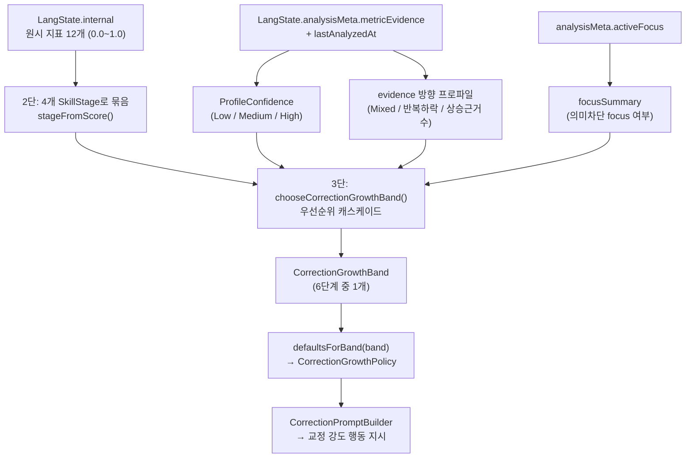
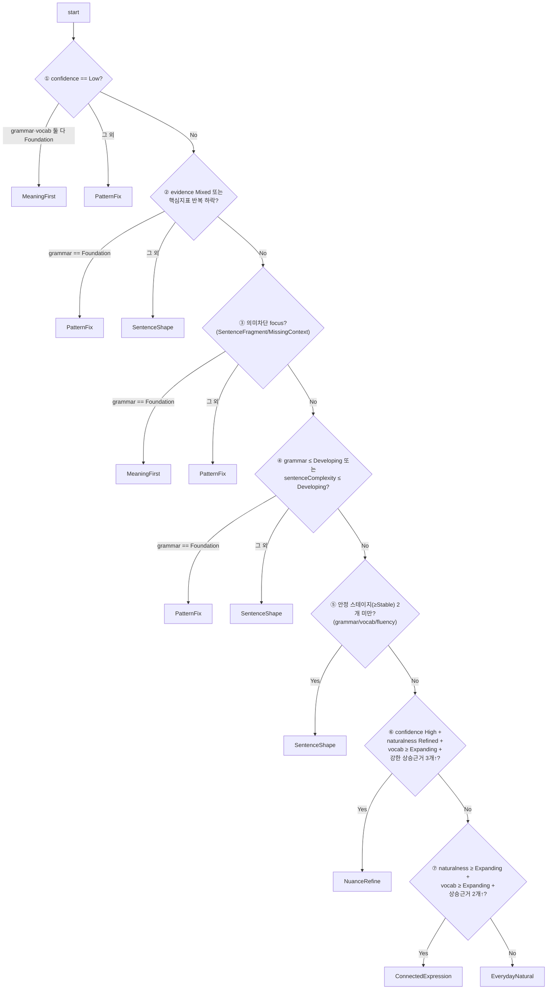

# [Reference] COR-REF-001 교정 band 산출 기준 레퍼런스

> **이 문서의 성격**
> 이건 구현 작업(COR-TUNE/COR-FIX) 이슈가 아니라, 이미 구현된 교정 band 산출 로직을
> 표·플로우차트로 **정리만 해 둔 참조 문서**다. 작업할 때 매번 코드를 역추적하지 않도록
> "원시 지표 → 스테이지 → band"의 결정 기준과 상수, 상승/하락 조건, 테스트용 입력 조건을 모은다.
>
> **단일 진실(SSOT)은 코드다.** 숫자/규칙이 코드와 어긋나면 코드가 맞다. 코드를 바꾸면 이 문서도 같이 갱신한다.
> 산출 로직 원본: `BuildLearnerAdaptationProfileUseCase`, band 정의·정책 매핑 원본: `CorrectionGrowthPolicyModels`.

---

## 1. 한눈에 보기 — band는 저장값이 아니라 매번 계산되는 파생값

교정 band(`CorrectionGrowthBand`)는 **어디에도 저장되지 않는다.** 교정할 때마다
`BuildLearnerAdaptationProfileUseCase`가 현재 `LangState`에서 즉석으로 다시 계산하고 버린다.

- **저장되는 것 (재료)**: `LangState.internal`(원시 지표 12개) + `LangState.analysisMeta.metricEvidence`(반복 관측 근거) + `lastAnalyzedAt`
- **계산되는 것 (결과)**: 4개 SkillStage → ProfileConfidence → **band** → `CorrectionGrowthPolicy`

이 구조의 의도:
- 진짜 근거는 지표/evidence 하나뿐(SSOT). band를 저장하면 둘이 어긋날(stale) 위험이 생긴다.
- 산출 규칙을 바꿔도 데이터 마이그레이션이 필요 없다. 다음 교정에서 모든 사용자가 새 기준으로 자동 재계산된다.
- Chat band(`ConversationAbilityBand`, 대화 지속성 축)와 Correction band(교정 처리 가능성 축)는 다른 축이다. 재료만 공유하고 해석은 각자 한다.

---

## 2. 전체 파이프라인 (3단 변환)

코드 진입점: `CorrectionViewModel.triggerGeneration()` → `buildLearnerAdaptationProfile(langState)`.

---

## 3. [1단] 원시 지표 (InternalMetrics)

저장되는 12개 지표. 모두 `0.0~1.0`(단, `vocabularyLevel`은 CEFR enum). 신규 사용자는 전부 0 / A1로 시작한다.

| 지표 | 의미 | band 산출에 쓰임? |
| --- | --- | --- |
| `grammarAccuracy` | 문법/문장 정확도 | ✅ grammarStage (단독) |
| `vocabularyAppropriateness` | 단어 선택의 문맥 적절성 | ✅ vocabularyStage |
| `lexicalDiversity` | 표현 다양성(중복 안 함) | ✅ vocabularyStage |
| `vocabularyLevel` (CEFR) | A1~C2 어휘 등급 | ✅ vocabularyStage (보조) |
| `sentenceComplexity` | 복합문 처리 능력 | ✅ band 우선순위 4단계 게이트 (독립) |
| `speechRate` | 발화 속도 | ✅ fluencyStage |
| `pauseFrequency` | 머뭇거림 빈도 | ✅ fluencyStage (1−값으로 반전) |
| `avgUtteranceLength` | 한 발화의 길이 | ✅ fluencyStage |
| `spokenNaturalness` | 구어체 자연스러움 | ✅ naturalnessStage |
| `naturalExpressionUsage` | 원어민식 표현 활용 | ✅ naturalnessStage |
| `errorRecurrence` | 교정한 실수 재발 정도 | ⚠️ 직접 미사용 (evidence/LS 갱신 쪽) |
| `reviewRetention` | SRS 복습 유지율 | ⚠️ 직접 미사용 (evidence/LS 갱신 쪽) |

> `external` metric(화면/통계용)은 band 산출에 쓰지 않는다. 예외: `expressionRange` 하나만 vocabulary 보조 신호로 읽는다(상한 80 = C2 후보 기준).

---

## 4. [2단] 원시 지표 → SkillStage

### 4-1. stageFromScore 임계값

| 점수 범위 | SkillStage | 의미 |
| --- | --- | --- |
| `0.00 ~ <0.25` | **Foundation** | 짧고 쉬운 패턴 중심 지원 필요 |
| `0.25 ~ <0.45` | **Developing** | 기본 문장은 되지만 한 번에 하나씩 확장 |
| `0.45 ~ <0.65` | **Stable** | 기본 대화 안정적, 후속 질문 가능 |
| `0.65 ~ <0.82` | **Expanding** | 다양한 표현·연결어·구어체 조금씩 |
| `0.82 ~ 1.00` | **Refined** | 뉘앙스·register·collocation까지 |

(상수: `FOUNDATION_MAX=0.25`, `DEVELOPING_MAX=0.45`, `STABLE_MAX=0.65`, `EXPANDING_MAX=0.82`)

### 4-2. 4개 스테이지가 묶는 지표

| 스테이지 | 계산식 |
| --- | --- |
| **grammarStage** | `grammarAccuracy` (단독) |
| **vocabularyStage** | 평균( `vocabularyAppropriateness`, `lexicalDiversity`, max(CEFR레벨 점수, expressionRange 점수) ) |
| **fluencyStage** | 평균( `speechRate`, `1 − pauseFrequency`, `avgUtteranceLength` ) |
| **naturalnessStage** | 평균( `spokenNaturalness`, `naturalExpressionUsage` ) |
| (sentenceComplexityStage) | `sentenceComplexity` (단독, band 4단계 게이트 전용) |

---

## 5. ProfileConfidence 산출 (band 게이트의 핵심)

confidence는 "지표를 얼마나 믿을지"다. 점수가 높아도 confidence가 낮으면 상위 band로 못 올라간다.

순서대로 판정(`estimateProfileConfidence`):

| 조건 | 결과 |
| --- | --- |
| evidence 없음 + `lastAnalyzedAt == null` (초기 snapshot) | **Low** |
| evidence 방향 충돌(Mixed) 있음 **또는** 스테이지 최대-최소 차 ≥ 3 | **Low** |
| 의미 있는 metric 없음 + 누적 관측 0 | **Low** |
| 누적 관측 ≥ 6 **그리고** 보정 confidence 평균 ≥ 0.75 | **High** |
| 누적 관측 ≥ 2 **또는** (`lastAnalyzedAt` 있음 + 의미 있는 metric 있음) | **Medium** |
| 그 외 | **Low** |

(상수: `HIGH_EVIDENCE_COUNT=6`, `MEDIUM_EVIDENCE_COUNT=2`, `HIGH_CONFIDENCE_SCORE=0.75`, `HIGH_SPREAD_STAGE_DISTANCE=3`, `MEANINGFUL_METRIC_MIN=0.05`)

---

## 6. [3단] band 산출 — 우선순위 캐스케이드

`chooseCorrectionGrowthBand()`는 **위에서부터 순서대로 검사**해 먼저 걸리는 규칙이 이긴다.

> **참고**: `LangState`가 아예 없거나 의미 있는 분석이 없으면 캐스케이드 이전에 `conservativeProfile()`이
> 곧장 **MeaningFirst**를 반환한다(첫 교정 cold start).

---

## 7. band별 = 학습자 수준 + 산출 조건 + 교정 강도

| band | 학습자 수준 | 주요 산출 조건 | 교정 강도(defaultsForBand 요약) |
| --- | --- | --- | --- |
| **MeaningFirst** | 단어 조각·모국어 섞인 발화. 의미 전달부터 | LangState 근거 없음(기본값); 또는 Low+grammar·vocab 둘 다 Foundation; 또는 의미차단 focus+grammar Foundation | 의미 보존(Strict)·확장 없음·새 표현 없음·모국어로 짧게 설명 |
| **PatternFix** | 짧은 구/고정 표현은 됨, 문장 뼈대 약함 | Low인데 일부 vocab 근거; 또는 충돌/하락+grammar Foundation; 또는 의미차단 focus+grammar≠Foundation; 또는 4단계 grammar Foundation | 핵심 오류 1개만·작은 구 1개·쉬운 단어 1개 |
| **SentenceShape** | 짧은 문장은 되나 어순·시제 흔들림 | 충돌/하락+grammar≠Foundation; 또는 grammar≤Developing 또는 sentenceComplexity≤Developing; 또는 안정 스테이지 2개 미만 | 문장 완성 + 작은 확장 1개·일상 말투 |
| **EverydayNatural** | 기본 일상 대화 가능 | 하위 게이트 다 통과(안정 2개↑·grammar>Developing)했으나 상위 근거 부족 → **상위권 기본값** | 같은 뜻을 더 자연스럽게·일상 표현 1개 추가 |
| **ConnectedExpression** | 이유·감정·상황 설명 가능 | naturalness·vocab 둘 다 Expanding(≥0.65) + **상승 근거 2개 metric↑** | 연결 표현·collocation·구어체 다듬기 |
| **NuanceRefine** | 의미 안정적, 뉘앙스·말투가 성장 지점 | **confidence High** + naturalness Refined(≥0.82) + vocab Expanding↑ + **강한 상승 근거 3개 metric↑** | register·뉘앙스·원어민식 선택 세밀 교정 |

> band별 전체 정책 8축(scope/grammar/vocabulary/sentenceExpansion/register/explanation/newExpressionLimit/primaryLanguageSupport/meaningPreservation)은
> `CorrectionGrowthPolicy.defaultsForBand()` 참조. 나이 비유("아기 수준" 등)는 팀 내부 이해용이며 코드·prompt·화면에 노출하지 않는다.

---

## 8. band 상승 / 하락

### 8-1. 상승의 근거 — 점수만으론 안 오른다

상승은 다음 3가지가 **동시에** 충족돼야 한다.

1. 원시 지표 상승 → 스테이지 상승
2. confidence 상승 (누적 관측 ≥6 + 보정 confidence ≥0.75 → High). 단일 고점만으론 안 됨.
3. **상위 band일수록 "상승(Up) 방향 evidence"가 여러 축에서 반복**돼야 함:
   - ConnectedExpression: Up + `directionCount≥2` + confidence≥0.5 인 metric **2개 이상**
   - NuanceRefine: Up + confidence≥0.75(강한 근거) 인 metric **3개 이상**

→ 상승의 진짜 연료는 `MetricEvidence`(observedCount·direction·directionCount·confidence)다. 운 좋은 한 세션은 실력을 점프시키지 못한다.

(상수: `CONNECTED_EXPRESSION_EVIDENCE_COUNT=2`, `NUANCE_REFINE_EVIDENCE_COUNT=3`)

### 8-2. 하락 — 가능하다. 그리고 상승보다 쉽다 (의도된 비대칭)

band는 매번 새로 계산되므로 입력이 나빠지면 즉시 낮아진다.

| 하락 트리거 | 결과 |
| --- | --- |
| 원시 지표 하락 → 스테이지 하락 | band 자동 하락 |
| confidence가 Low로 떨어짐 (우선순위 ①) | MeaningFirst/PatternFix로 강제 강등 |
| evidence 충돌(Mixed) 또는 핵심지표(Grammar/Sentence/Vocab) 반복 하락 (우선순위 ②) | PatternFix/SentenceShape로 강등 |

비대칭이 의도된 이유: 앱 철학상 **"애매하면 과교정하지 말고 안전한(낮은) band로"**. 올라갈 땐 여러 축의 누적 근거가 필요(느림), 내려올 땐 신호 한 번 흔들려도 빠르게(보수적).

> ⚠️ 단, **원시 지표 자체가 실제로 떨어지는지/얼마나 자주 떨어지는지**는 LangState 갱신 정책(LS-006) 소관이다.
> band 산출 로직은 "입력이 나빠지면 내린다"가 확실하지만, 입력 변동 빈도는 별개 영역이다.

---

## 9. 테스트용 치트시트 — 원하는 band를 만들려면 LangState를 이렇게

band는 직접 set할 수 없다(파생값). 그 band가 나오도록 `LangState`를 조립해야 한다.

| 원하는 band | LangState 구성 |
| --- | --- |
| MeaningFirst | `LangState.initial()` 그대로(근거 없음 → 자동) 또는 `langState = null` |
| PatternFix | grammar 약간 + vocab 일부, evidence 적어 confidence Low 유지 |
| SentenceShape | `grammarAccuracy ~0.3`, sentenceComplexity 낮게, evidence 2개↑로 confidence Medium |
| EverydayNatural | grammar/vocab/fluency 중 2개 ≥0.45(Stable), grammar>0.25, 충돌 없음 |
| ConnectedExpression | naturalness·vocab ≥0.65 + metricEvidence에 (Up·directionCount≥2·conf≥0.5) metric 2개 |
| NuanceRefine | naturalness ≥0.82, vocab ≥0.65, confidence High(관측 6회↑·conf 0.75↑) + 강한 Up 근거 3개 |

> **흔한 함정**: `internal` 점수만 높이고 `analysisMeta.metricEvidence`/`lastAnalyzedAt`를 비워 두면
> confidence가 Low로 떨어져 계속 낮은 band가 나온다. 상위 band 테스트 시 **evidence와 분석 시각을 반드시 함께** 채울 것.

---

## 10. 코드 참조 (SSOT)

| 대상 | 위치 |
| --- | --- |
| band 산출 전체 | `domain/usecase/learningstate/BuildLearnerAdaptationProfileUseCase.kt` |
| ├ 스테이지 변환 | `stageFromScore()` |
| ├ confidence 산출 | `estimateProfileConfidence()` |
| ├ band 캐스케이드 | `chooseCorrectionGrowthBand()` |
| ├ evidence 프로파일 | `correctionGrowthEvidenceProfile()` |
| └ 상수 | 동 파일 `private companion object` |
| band 정의 + 정책 매핑 | `domain/model/learningstate/CorrectionGrowthPolicyModels.kt` (`CorrectionGrowthBand`, `defaultsForBand`) |
| 원시 지표/evidence 모델 | `domain/model/learningstate/LearningStateModels.kt` (`InternalMetrics`, `MetricEvidence`, `LangState`) |
| 정책 소비(프롬프트) | `data/repository/correction/CorrectionPromptBuilder.kt` |
| 산출 회귀 테스트 | `domain/usecase/learningstate/BuildLearnerAdaptationProfileUseCaseTest.kt` |

---

## 11. 관련 문서

- `COR-TUNE-003_Correction_Growth_Policy.md` (6단계 성장 정책 도입 / band 정의 / 정책 매핑)
- `COR-TUNE-005_Band_FewShot_Prompt_Tuning.md` (band별 few-shot으로 출력 형태 정렬)
- `COR-TUNE-006_Correction_Overexpansion_Runtime_Guard.md` (과확장/의미위반 런타임 차단)
- `docs/handover/CHAT-TUNE-004_CORRECTION_GROWTH_POLICY_HANDOVER.md` (band 산출 우선순위 원본 스펙)
- `docs/System_FlowDB/SYS_LEARNING_STATE_INFRA/LS-006_Language_State_Update_Policy.md` (원시 지표 갱신 정책 — 지표가 오르내리는 원천)
